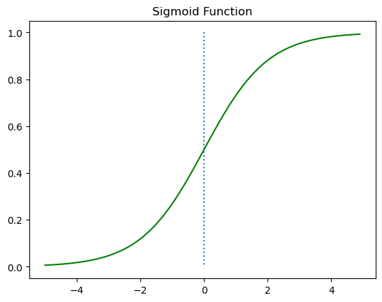
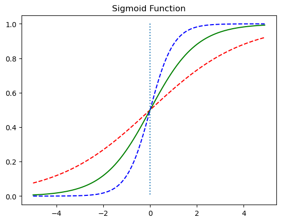
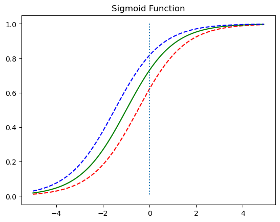

# 5. Logistic Classification

### Hypothesis

Sigmoid:

$$ H(x) = \sigma (Wx + b) = \frac{1}{1 + e^{-(Wx + b)}}$$


```python
%matplotlib inline 

import numpy as np 
import matplotlib.pyplot as plt

def sigmoid(x):
    return 1/(1+np.exp(-x))

x = np.arange(-5.0, 5.0, 0.1)
y = sigmoid(x)

plt.plot(x, y, 'g')
plt.plot([0,0],[1.0,0.0], ':') # 가운데 점선 추가
plt.title('Sigmoid Function')
plt.show()

# different W values
x = np.arange(-5.0, 5.0, 0.1)
y1 = sigmoid(0.5*x)
y2 = sigmoid(x)
y3 = sigmoid(2*x)

plt.plot(x, y1, 'r', linestyle='--') # W의 값이 0.5일때
plt.plot(x, y2, 'g') # W의 값이 1일때
plt.plot(x, y3, 'b', linestyle='--') # W의 값이 2일때
plt.plot([0,0],[1.0,0.0], ':') # 가운데 점선 추가
plt.title('Sigmoid Function')
plt.show()


# different b values
x = np.arange(-5.0, 5.0, 0.1)
y1 = sigmoid(x+0.5)
y2 = sigmoid(x+1)
y3 = sigmoid(x+1.5)

plt.plot(x, y1, 'r', linestyle='--') # x + 0.5
plt.plot(x, y2, 'g') # x + 1
plt.plot(x, y3, 'b', linestyle='--') # x + 1.5
plt.plot([0,0],[1.0,0.0], ':') # 가운데 점선 추가
plt.title('Sigmoid Function')
plt.show()
```


    

    


    

    


    

    


### Cost

$$ cost(W,b) = -\frac{1}{m} \sum y \log\left(H(x)\right) + (1-y) \left( \log(1-H(x) \right) $$


Here, we replace $H(x) = Wx + b$  with $H(x) = \sigma(Wx + b)$.

### Weight Update via Gradient Descent

$$ W := W - \alpha \frac{\partial}{\partial W} cost(W) $$

 - $\alpha$: Learning rate

## Imports


```python
import torch
import torch.nn as nn
import torch.nn.functional as F
import torch.optim as optim
```


```python
# For reproducibility
torch.manual_seed(1)
```


    <torch._C.Generator at 0x7fddb8ce2a90>


## Training Data


```python
x_data = [[1, 2], [2, 3], [3, 1], [4, 3], [5, 3], [6, 2]]
y_data = [[0], [0], [0], [1], [1], [1]]
```

Consider the following classification problem: given the number of hours each student spent watching the lecture and working in the code lab, predict whether the student passed or failed a course. For example, the first (index 0) student watched the lecture for 1 hour and spent 2 hours in the lab session ([1, 2]), and ended up failing the course ([0]).


```python
x_train = torch.FloatTensor(x_data)
y_train = torch.FloatTensor(y_data)
```

As always, we need these data to be in `torch.Tensor` format, so we convert them.


```python
print(x_train.shape)
print(y_train.shape)
```

    torch.Size([6, 2])
    torch.Size([6, 1])
    

## Computing the Hypothesis

$$ H(X) = \frac{1}{1+e^{-(W^T X + b)}} $$


```python
W = torch.zeros((2, 1), requires_grad=True)
b = torch.zeros(1, requires_grad=True)
```


```python
hypothesis = 1 / (1 + torch.exp(-(x_train.matmul(W) + b)))
```


```python
print(hypothesis)
print(hypothesis.shape)
```

    tensor([[5.4423e-05],
            [1.6844e-02],
            [2.0160e-02],
            [9.7644e-01],
            [9.9951e-01],
            [9.9994e-01]], grad_fn=<MulBackward0>)
    torch.Size([6, 1])
    

Or, we could use `torch.sigmoid()` function! This resembles the sigmoid function:


```python
hypothesis = torch.sigmoid(x_train.matmul(W) + b)
```


```python
print(hypothesis)
print(hypothesis.shape)
```

    tensor([[5.4423e-05],
            [1.6844e-02],
            [2.0160e-02],
            [9.7644e-01],
            [9.9951e-01],
            [9.9994e-01]], grad_fn=<SigmoidBackward0>)
    torch.Size([6, 1])
    

## Computing the Cost Function (Low-level)

$$ cost(W) = -\frac{1}{m} \sum y \log\left(H(x)\right) + (1-y) \left( \log(1-H(x) \right) $$

We want to measure the difference between `hypothesis` and `y_train`.


```python
print(hypothesis)
print(y_train)
```

    tensor([[5.4423e-05],
            [1.6844e-02],
            [2.0160e-02],
            [9.7644e-01],
            [9.9951e-01],
            [9.9994e-01]], grad_fn=<SigmoidBackward0>)
    tensor([[0.],
            [0.],
            [0.],
            [1.],
            [1.],
            [1.]])
    

For one element, the loss can be computed as follows:


```python
-(y_train[0] * torch.log(hypothesis[0]) + 
  (1 - y_train[0]) * torch.log(1 - hypothesis[0]))
```


    tensor([5.4421e-05], grad_fn=<NegBackward0>)


To compute the losses for the entire batch, we can simply input the entire vector.


```python
losses = -(y_train * torch.log(hypothesis) + 
           (1 - y_train) * torch.log(1 - hypothesis))
print(losses)
```

    tensor([[5.4421e-05],
            [1.6988e-02],
            [2.0366e-02],
            [2.3840e-02],
            [4.9043e-04],
            [6.3779e-05]], grad_fn=<NegBackward0>)
    

Then, we just `.mean()` to take the mean of these individual losses.


```python
cost = losses.mean()
print(cost)
```

    tensor(0.0103, grad_fn=<MeanBackward0>)
    

## Computing the Cost Function with `F.binary_cross_entropy`

In reality, binary classification is used so often that PyTorch has a simple function called `F.binary_cross_entropy` implemented to lighten the burden.


```python
F.binary_cross_entropy(hypothesis, y_train)
```


    tensor(0.0103, grad_fn=<BinaryCrossEntropyBackward0>)


## Training with `F.binary_cross_entropy`


```python
# initialization
W = torch.zeros((2, 1), requires_grad=True)
b = torch.zeros(1, requires_grad=True)
# optimizer
optimizer = optim.SGD([W, b], lr=1)

nb_epochs = 5000
for epoch in range(nb_epochs + 1):

    # Cost 계산
    hypothesis = torch.sigmoid(x_train.matmul(W) + b) # or .mm or @
    cost = F.binary_cross_entropy(hypothesis, y_train)

    # cost로 H(x) 개선
    optimizer.zero_grad()
    cost.backward()
    optimizer.step()

    
    if epoch % 500 == 0:
        print('Epoch {:4d}/{} Cost: {:.6f}'.format(
            epoch, nb_epochs, cost.item()
        ))
```

    Epoch    0/5000 Cost: 0.693147
    Epoch  500/5000 Cost: 0.037261
    Epoch 1000/5000 Cost: 0.019852
    Epoch 1500/5000 Cost: 0.013562
    Epoch 2000/5000 Cost: 0.010305
    Epoch 2500/5000 Cost: 0.008311
    Epoch 3000/5000 Cost: 0.006965
    Epoch 3500/5000 Cost: 0.005994
    Epoch 4000/5000 Cost: 0.005260
    Epoch 4500/5000 Cost: 0.004687
    Epoch 5000/5000 Cost: 0.004227
    


```python
hypothesis = torch.sigmoid(x_train.matmul(W) + b)
print(hypothesis)

# If hypothesis > 0.5, then True. Otheriwse, False
prediction = hypothesis >= torch.FloatTensor([0.5])
print(prediction)
```

    tensor([[5.8982e-06],
            [7.0134e-03],
            [8.2570e-03],
            [9.9012e-01],
            [9.9992e-01],
            [9.9999e-01]], grad_fn=<SigmoidBackward0>)
    tensor([[False],
            [False],
            [False],
            [ True],
            [ True],
            [ True]])
    

## Logistic regression wth nn.Module


```python
import torch
import torch.nn as nn
import torch.nn.functional as F
import torch.optim as optim

torch.manual_seed(1)


```


    <torch._C.Generator at 0x7fddb8ce2a90>


```python
x_data = [[1, 2], [2, 3], [3, 1], [4, 3], [5, 3], [6, 2]]
y_data = [[0], [0], [0], [1], [1], [1]]
x_train = torch.FloatTensor(x_data)
y_train = torch.FloatTensor(y_data)
```

nn.Sequential()은 nn.Module 층을 차례로 쌓을 수 있음: nn.Sequential()은 $Wx + b$ 와 같은 수식과 sigmoid function 등과 같은 여러 함수들을 연결.


```python
model = nn.Sequential(
   nn.Linear(2, 1), # input_dim = 2, output_dim = 1
   nn.Sigmoid() # 출력은 시그모이드 함수를 거친다
)
```


```python
model(x_train)
```


    tensor([[0.3600],
            [0.2872],
            [0.6801],
            [0.4389],
            [0.5216],
            [0.7473]], grad_fn=<SigmoidBackward0>)


```python
# optimizer 설정
optimizer = optim.SGD(model.parameters(), lr=1)

nb_epochs = 1000
for epoch in range(nb_epochs + 1):

    # H(x) 계산
    hypothesis = model(x_train)

    # cost 계산
    cost = F.binary_cross_entropy(hypothesis, y_train)

    # cost로 H(x) 개선
    optimizer.zero_grad()
    cost.backward()
    optimizer.step()

    # 20번마다 로그 출력
    if epoch % 100 == 0:
        prediction = hypothesis >= torch.FloatTensor([0.5]) # 예측값이 0.5를 넘으면 True로 간주
        correct_prediction = prediction.float() == y_train # 실제값과 일치하는 경우만 True로 간주
        accuracy = correct_prediction.sum().item() / len(correct_prediction) # 정확도를 계산
        print('Epoch {:4d}/{} Cost: {:.6f} Accuracy {:2.2f}%'.format( # 각 에포크마다 정확도를 출력
            epoch, nb_epochs, cost.item(), accuracy * 100,
        ))
```

    Epoch    0/1000 Cost: 0.019941 Accuracy 100.00%
    Epoch  100/1000 Cost: 0.018239 Accuracy 100.00%
    Epoch  200/1000 Cost: 0.016806 Accuracy 100.00%
    Epoch  300/1000 Cost: 0.015583 Accuracy 100.00%
    Epoch  400/1000 Cost: 0.014526 Accuracy 100.00%
    Epoch  500/1000 Cost: 0.013604 Accuracy 100.00%
    Epoch  600/1000 Cost: 0.012792 Accuracy 100.00%
    Epoch  700/1000 Cost: 0.012072 Accuracy 100.00%
    Epoch  800/1000 Cost: 0.011429 Accuracy 100.00%
    Epoch  900/1000 Cost: 0.010851 Accuracy 100.00%
    Epoch 1000/1000 Cost: 0.010329 Accuracy 100.00%
    


```python
model(x_train)
print(list(model.parameters()))

```

    [Parameter containing:
    tensor([[3.8933, 1.8551]], requires_grad=True), Parameter containing:
    tensor([-17.4164], requires_grad=True)]
    

## Using Class


```python
class BinaryClassifier(nn.Module):
    def __init__(self):
        super().__init__()
        self.linear = nn.Linear(2, 1)
        self.sigmoid = nn.Sigmoid()

    def forward(self, x):
        return self.sigmoid(self.linear(x))
```

클래스(class) 형태의 모델은 nn.Module 을 상속

__init__()에서 모델의 구조와 동적을 정의하는 생성자를 의미함. 객체가 생성될 때 자동으호 호출

super() 함수를 부르면 여기서 만든 클래스는 nn.Module 클래스의 속성들을 가지고 초기화. 

foward() 함수는 모델이 학습데이터를 입력받아서 forward 연산을 진행시키는 함수. model 객체를 데이터와 함께 호출하면 자동으로 실행


```python
import torch
import torch.nn as nn
import torch.nn.functional as F
import torch.optim as optim

torch.manual_seed(1)

x_data = [[1, 2], [2, 3], [3, 1], [4, 3], [5, 3], [6, 2]]
y_data = [[0], [0], [0], [1], [1], [1]]
x_train = torch.FloatTensor(x_data)
y_train = torch.FloatTensor(y_data)

class BinaryClassifier(nn.Module):
    def __init__(self):
        super().__init__()
        self.linear = nn.Linear(2, 1)
        self.sigmoid = nn.Sigmoid()

    def forward(self, x):
        return self.sigmoid(self.linear(x))
    
model = BinaryClassifier()

# optimizer 설정
optimizer = optim.SGD(model.parameters(), lr=1)

nb_epochs = 1000
for epoch in range(nb_epochs + 1):

    # H(x) 계산
    hypothesis = model(x_train)

    # cost 계산
    cost = F.binary_cross_entropy(hypothesis, y_train)

    # cost로 H(x) 개선
    optimizer.zero_grad()
    cost.backward()
    optimizer.step()


    if epoch % 100 == 0:
        prediction = hypothesis >= torch.FloatTensor([0.5]) 
        correct_prediction = prediction.float() == y_train # 실제값과 일치하는 경우만 True로 간주
        accuracy = correct_prediction.sum().item() / len(correct_prediction) # 정확도를 계산
        print('Epoch {:4d}/{} Cost: {:.6f} Accuracy {:2.2f}%'.format( # 각 에포크마다 정확도를 출력
            epoch, nb_epochs, cost.item(), accuracy * 100,
        ))
```

    Epoch    0/1000 Cost: 0.539713 Accuracy 83.33%
    Epoch  100/1000 Cost: 0.134272 Accuracy 100.00%
    Epoch  200/1000 Cost: 0.080486 Accuracy 100.00%
    Epoch  300/1000 Cost: 0.057820 Accuracy 100.00%
    Epoch  400/1000 Cost: 0.045251 Accuracy 100.00%
    Epoch  500/1000 Cost: 0.037228 Accuracy 100.00%
    Epoch  600/1000 Cost: 0.031649 Accuracy 100.00%
    Epoch  700/1000 Cost: 0.027538 Accuracy 100.00%
    Epoch  800/1000 Cost: 0.024381 Accuracy 100.00%
    Epoch  900/1000 Cost: 0.021877 Accuracy 100.00%
    Epoch 1000/1000 Cost: 0.019843 Accuracy 100.00%
    


```python

```
