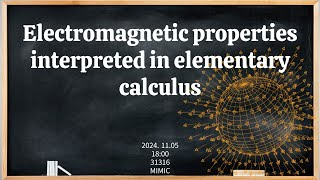

# Electromagnetic properties interpreted in elementary calculus
<!-- ## 
 Abstract 

Francis Guthrie claimed in 1852 the four color problem. We
proof two essential lemmas and then solve six color problem. We expand
the proof of six color problem into five, four color problem. Kempe
published this proof in 1879. However the flaw was discovered in 1890
by Heawood. Although flawed, Kempe’s idea was used as one of a basic
tool. -->
## Video Link

<!-- ## PDF Download -->

<!-- <a target='_blank' href='../2024-1/2024-1_download/crime.pdf'>What is Counting? PDF</a> -->