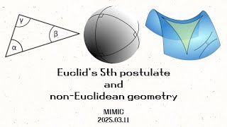

# Euclid's 5th Postulate and non-Euclidean Geometry

**Speaker:** Mingook Kim (Sungkyunkwan University)  

## 
 주요어 

Axiom

Euclidean

non-Euclidean

   
## 
 초록 

&emsp;첫 세미나인만큼 쉽고 또 직관적이면서도 생각할 거리가 많은 주제입니다. 특히 많은 수학적 이론을 아직 알지 못하셔도 스스로 고민해볼만한 요소가 매우 많으며, 수학 공부를 계속 하다보면 더욱 더 많은 고민할 요소가 생기는 아주 매력적인 주제여서 선택했습니다. 
&emsp;저의 이번 세미나는 특히 1학년 학우들을 위한 세미나입니다. 고등학교 수학과 대학교 수학이 매우 다르다는 이야기를 정말 많이 들으셨을텐데, 비록 극히 일부이지만 대학교 수학은 어떤 흐름으로 진행되는지 느껴주시면 좋겠습니다. 또한 제가 몇 가지 질문들을 던질테니, 여러분들께서는 세미나 이후 이를 고민하시면서 지적 유희를 즐기시면 되겠습니다. 
&emsp;기원전부터 시작된 '기하'라는 학문에 대한 수학자들의 고민과, 이를 통한 이론의 발전이 정말 잘 느껴지는 주제인 만큼 이러한 발전의 스토리를 세미나 때 풀어드릴 예정입니다. 또한 위에서 적었듯 누구나 다 쉽게 참여해보고 고민해볼 수 있는 내용입니다. 
&emsp;고등학교 때 얼핏 책에서 삼각형의 세 각의 합이 180도가 아닐 수도 있다고 봤던 기억이 납니다. 구 위에 삼각형을 그려보면, 너무나도 당연해 보여서 그 당시에는 별 생각이 들지 않았습니다. 그러나 군복학 이후 '기하학일반'이라는 강의를 들어보고 저의 생각은 매우 바뀌었습니다. 기원전부터 '기하'라는 분야를 수학자들이 정말 오랜 고민끝에 체계적으로, 아름답게 만들어낸 것이 정말 와닿았습니다. 이러한 즐거움을 세미나로 풀어보고 싶어 2년전에 미믹 세미나에서 '유재훈' 연사가 똑같은 주제로 발표했음에도 불구하고 다시 주제로 선정했습니다. 
&emsp;세미나를 준비하면서 저도 다시 책을 펼쳐보고 인터넷을 뒤져봤습니다. '기하학일반' 강의를 들을 때는 별 생각 없이 넘어갔던 부분들이 있었는데, 세미나 준비 과정에서 다시 고민해보니 엄밀하지 않은것 같다는 생각이 많이 들어 이를 찾아본 것입니다. 그렇게 인터넷을 뒤져도 잘 나오지 않아 직접 종이와 펜을 잡고 도형들을 하나 하나 그렸습니다. 간단하면서도 당연하지 않는 부분들을 다시 증명하고 이해하니 시간이 오래  걸려도 정말 재밌었습니다. 이러한 과정을 여러분들도 경험하시면 좋을 것 같아서 중간 퀴즈로 넣었으니 잘 즐겨주시길 바라겠습니다. 

## Video Link

<!-- ## PDF Download -->

<!-- <a target='_blank' href='../2024-1/2024-1_download/crime.pdf'>What is Counting? PDF</a> -->