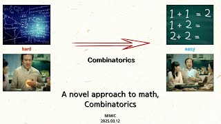

# A Novel Approach to Math, Combinatorics

**Speaker:** Hojoon Lee (Sungkyunkwan University)  

## 
 주요어 

카탈란 수(Catalan number)

격자 경로(Lattice path)

체비셰프 다항식(Chebyshev polynomial)

   
## 
 초록 

### 주제를 선택한 이유
You start out in life doing mathematics, you end up doing combinatorics(조합론). - Ian Macdonald 
고등학교 때 미적분, 방정식을 통해 해석학과 대수학을 접했는데 조합론은 경우의 수를 제외하고는 접할 기회가 없었습니다. 그렇다보니 대학에서 조합론을 처음 접할 때 낯설어하는 학생들이 많습니다. 그러나, 허준이 교수님이 조합론과 대수기하를 잇는 연구를 통해 필즈상을 받은 것처럼 현대 수학에서 조합론이 미치는 영향은 상당합니다. 이에 저의 전공분야인 조합론을 소개하고자 이 주제를 선택하였습니다.

### 이 세미나의 목표
조합론이 무엇을 하는 분야이고, 어떤 대상을 흥미로워하고, 수학에는 어떤 영향을 주는지 그 느낌을 알고 이산수학이든 조합 및 그래프 이론이든 앞으로 수학을 공부할 때 조합론을 만나면 반가워하셨으면 좋겠습니다.

### 어떤 점이 재밌나요?
제가 생각하는 조합론의 매력은 어려운 수학을 직관적으로 쉽게 바꾸는 과정에 있습니다. 이런 매력을 예시를 통해 간접적으로 느낄 수 있게 준비하였습니다.

### 이외에 하고 싶은 말
사람의 직관과 가장 가까이에 있지만 많은 사람에겐 낯선 분야인 조합론을 카탈란 수를 통해 소개하고, 어려워 보이는 수학에 대해서 어떻게 조합론으로 쉽게 풀어가는지 보여줍니다. 많은 관심과 참여 부탁드립니다.

## Video Link

<!-- ## PDF Download -->

<!-- <a target='_blank' href='../2024-1/2024-1_download/crime.pdf'>What is Counting? PDF</a> -->