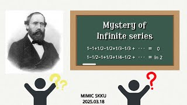

# Mystery of Infinite series

**Speaker:** Dahyeon Hwang (Sungkyunkwan University)  

## 
 Keyword 

리만 재배열 정리

무한급수

조화급수

   
## 
 Abstract 

### 주제를 선택한 이유
수학을 공부하다 보면 종종 직관에 반하는 사실을 접하게 됩니다. 이러한 것들은 골치 아프기도 하지만 매우 흥미롭습니다. 저는 많은 학우들 특히, 수학을 아직 많이 접해보지 않은 새내기분들이 이런 종류의 것들을 접해봤으면 좋겠다고 생각했습니다. 무한급수는 비직관적인 내용들이 많으면서 너무 어렵지 않은 수준의 수학으로 이해할 수 있기 때문에 이 주제를 선택했습니다.

### 이 세미나의 목표
이 세미나의 가장 큰 목표는 무한 급수에서 더하는 순서를 바꾸면 급수의 값이 달라질 수 있다는 리만 재배열 정리를 소개하고 그 속에 담긴 아이디어를 개략적으로 전달하는 것입니다. 부가적으로 너무 심하지 않게 더하는 순서를 바꿨을 때는 어떻게 되는지도 소개하고자 합니다.

### 어떤 점이 재밌나요?
더하는 순서를 바꿨더니 결과값이 달라졌다는 이해하기 힘든 사실을 실제 계산을 통해 이해해나가는 과정이 흥미로울 것으로 예상됩니다. 또, 더하는 순서를 너무 심하게 바꾸지 않았을 때 생기는 놀라운 결과가 흥미로울 것으로 예상됩니다.

## Video Link

<!-- ## PDF Download -->

<!-- <a target='_blank' href='../2024-1/2024-1_download/crime.pdf'>What is Counting? PDF</a> -->