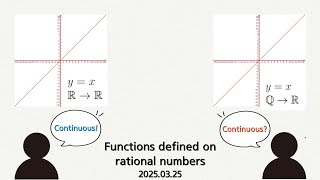

# Functions Defined on Rational Numbers

**Speaker:** Yesung Kook (Sungkyunkwan University)  
   
## 
 주요어 

디리클레 함수

엡실론 델타 논법

연속함수

   
## 
 초록 

&emsp;고등학교에서 함수의 극한 및 연속을 정의할 때, "한없이"라는 단어를 사용해 모호하게 정의하고 넘어갑니다. 물론 고등학교에서 학습할 때나 문제를 풀 때엔 그렇게 큰 문제가 발생하지 않지만, 굉장히 특이한 함수를 다룰때엔 "한없이"라는 단어의 이미지를 떠올리기가 어려워지게 됩니다. 이런 상황에서는 함수의 극한을 어떻게 생각을 할 수 있는지 보여드리고 싶어 이 주제를 선택했습니다. 또한, 기존에 실수 집합 위에서만 생각해왔던 연속을 좀 더 작은 집합인 유리수 집합나 다른 집합에서도 생각할 수 있는지, 할 수 있다면 어떻게 할 수 있는지 등을 얘기해보자 합니다. 
&emsp;이번 세미나를 통해 유리수 위에서 정의된 함수와 이외의 다른 함수들을 통해 함수의 연속성에 대해 이해하는 것이 가장 큰 목표입니다. 그러기 위해 우선 극한의 엄밀한 정의인 엡실론 덽타 논법의 직관적인 이해와 이를 통한 연속의 정의를 이해하는 것이 목표입니다. 또한, 거리가 주어지지 않은 집합에 대해서도 어떻게 연속함수를 정의할 수 있는지에 대해 알아보는 것이 마지막 목표입니다. 
&emsp;연속함수를 엄밀하게 정의함으로써 직관과 충돌하는 점이 많이 흥미롭습니다. 또한, 잘 정의만 된다면, 자유로운 상황을 얼마든지 상상할 수 있다는 점 또한 흥미로울 예정입니다. 
&emsp;이 주제에 대해 가벼우면서도 중요한 점들을 많이 준비했으니, 즐겁게 들어주시면 감사하겠습니다! 

## Video Link

<!--## ## PDF Download
<a target='_blank' href='download/EulerLagrange.pdf'>Euler-Lagrange equation PPT</a>-->