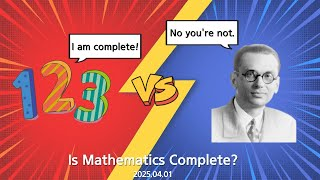

# Is Mathematics Complete?

**Speaker:** Chae-young Han (Sungkyunkwan University)  
   
## 
 Keyword 

Meta Mathematics

Russell's Paradox

Gödel's Incompleteness Theorems

   
## 
 Abstract 

### 주제를 선택한 이유
수학을 공부하다 보면 굉장히 논리적으로 완벽하고 엄밀한 학문이라는 것을 느끼게 됩니다. 하지만, 모든 명제가 참인지 거짓인지 판별할 수 있을까요? 당연히 그렇다고 생각하는 것이 일반적인 반응입니다. 괴델은 이 질문에 대해 굉장히 흥미로운 아이디어로 답을 제시했습니다. 이번 세미나를 들으시면서 수학의 위대함을 느끼시길 기대하며 이 주제를 선택했습니다. 

### 이 세미나의 목표
이 세미나는 칸토어의 집합론에서 출발해 러셀의 역설, 그리고 괴델의 불완전성 정리까지 이어지는 수학적 논쟁의 흐름을 따라가며, 수학이 어떻게 발전해왔는지 이해하실 수 있습니다. 결론적으로는 수학이 얼마나 위대한 학문인지, 수학을 좋아하는 사람들로서 수학 뽕에 차오를 수 있는 시간을 만드는 것이 목표가 되겠습니다. 

### 어떤 점이 재밌나요?
첫 번째로, 집합론에서 출발해 수학의 완벽함에 대한 논의가 이루어지는 흐름을 따라가다보면, 수학이 어떤 학문인지, 수학의 본질에 대해 다시 생각해보는 시간을 가질 수 있다는 점에서 흥미롭습니다. 
두 번째로, 괴델의 불완전성 정리로 인해 수학이 완벽한 학문인지 생각해 볼 수 있습니다. 이 정리의 결론 뿐만 아니라, 증명 방법 또한 흥미로워 충격과 놀라움을 경험하실 수 있으리라 생각합니다. 

### 이외에 하고 싶은 말
'수학이 완벽하다'는 문장은 참일까요, 거짓일까요? 마침 저의 세미나 날짜가 4월 1일 만우절인 만큼 이 물음에 대해 어떤 답을 생각하셨어도 거짓이라는 답변을 받으실 수 있는 세미나가 될 예정입니다. 최대한 쉽고 흥미로운 전개로 풀어볼 예정이니 많은 참여 부탁드립니다!

## Video Link

<!--## ## PDF Download
<a target='_blank' href='download/EulerLagrange.pdf'>Euler-Lagrange equation PPT</a>-->