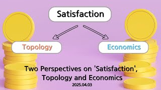

# Two Perspectives on 'Satisfaction', Topology and Economics

**Speaker:** Seong-eun Wang (Sungkyunkwan University)  
   
## 
 Keyword 

슈페르너의 보조정리

수렴

극대화

   
## 
 Abstract 

### 주제를 선택한 이유
수학을 좋아하는 사람이라면 누구나 증명에 관심을 가지실 것이라 생각합니다. 이번 세미나에서 다룰 슈페르너의 보조정리는 물리학적/수학적으로 두 가지 방법의 증명이 가능한 정리입니다. 증명 과정을 따라가며 깨달음을 얻었을 때의 희열을 학우분들과 함께 공유하고 싶습니다. 나아가 '만족감'과는 거리가 멀어보이는 '위상수학'으로 만족감을 바라보며 인간의 기본적 욕구를 설명하고자 합니다. 다만 수학의 관점으로만 바라보는 '만족감'은 분명 한계가 존재하기에, 이를 경제학적 관점으로 보완하여 두 학문의 연계성을 보여드리고자 이 주제를 선택했습니다.

### 이 세미나의 목표
개인적으로는 경제학과 위상수학을 정말 좋아합니다. 특히 이번 세미나에서는 위상수학에서 가장 흥미 있게 탐구했던 슈페르너의 보조정리의 증명을 물리학적/수학적으로 증명하고, 이를 경제학과 연결지어 설명하는 과정에서 서로 다른 학문의 융합을 보여드리고 싶습니다. 제가 사랑하는 두 학문의 매력에 여러분들도 빠져드는 계기가 되었으면 좋겠습니다.

### 어떤 점이 재밌나요?
인간의 기본적인 욕구인 '만족감'을 수학적, 경제학적으로 풀어낸다는 점이 흥미로울 것으로 예상됩니다. 특히 '만족감'을 바라보는 슈페르너의 보조정리와 경제학적 관점을 소개하며, 두 학문의 교차점을 찾아 알려드리는 과정에서 재미를 느끼실 수 있습니다. 

### 이외에 하고 싶은 말
위상수학과 경제학이라는 명칭은 무서운 두 학문을 엮었지만, 누구나 잘 이해하실 수 있도록 준비했습니다. 당장 저부터 수학 전공자가 아니기 때문에, 기초적인 증명부터 차근차근 알려드릴 예정입니다. 부담 없이 오셔서 즐거운 시간 보내다 가시면 감사하겠습니다!

## Video Link

<!--## ## PDF Download
<a target='_blank' href='download/EulerLagrange.pdf'>Euler-Lagrange equation PPT</a>-->