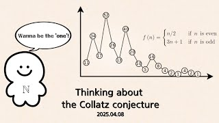

# Thinking about the Collatz Conjecture

**Speaker:** Hyunwoo Kim (Sungkyunkwan University)  
   
## 
 Keyword 

콜라츠 추측

미해결 난제

수학 문제의 접근 방식

   
## 
 Abstract 

### 주제를 선택한 이유
저는 중학교 3학년 쯤 이 문제에 대해 처음 알게 된 이후 가끔 이 문제에 대해 떠올려보곤 하였습니다. 그리고 그때마다 매번 신중히 고민하고, 그만두기를 반복하였죠. 그 시간은 정말이지 행복했던 것 같습니다. 풀릴 것 같으면서도 풀리지 않았으니까요. 그리고 얼마 전 테렌스 타오 교수의 해당 추측에 대한 논문을 읽고 아, 이 아이디어를 한 번 소개해 보고 싶다는 마음에 이 주제를 선택하였습니다.

### 이 세미나의 목표
콜라츠 추측에 대한 소개 및 추측에 대한 여러가지 접근 방식에 대해 소개하고, 수학 연구를 위해 필요한 것들에 대해 짤막하게 청자들이 느껴봄을 원합니다.

### 어떤 점이 재밌나요?
정수론에 대한 여러 문제 특히 콜라츠 추측과 같은 문제의 경우 이해하는 데는 전혀 어려움이 없습니다. 하지만, 문제를 해결해 나가는 과정이 매우 험난하기에 이 괴리감이 재밌을 것이라 생각합니다. 

### 이외에 하고 싶은 말
콜라츠 추측에 대해 반례 찾기, 테렌스 타오 교수의 방식, 제가 생각해 본 방식 크게 세 가지로 나누어 재미있게 준비해 보았으니 즐거운 참여 부탁드립니다!

## Video Link

<a target='_blank' href='download/HyunwooKim_PerspectiveoftheCollatzConjecture'>Supplement: Hyunwoo Kim's Perspective of the Collatz Conjecture PDF</a> 