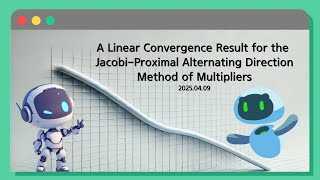

# A Linear Convergence Result for the Jacobi-Proximal Alternating Direction Method of Multipliers

**Speaker:** Hyerin Choi (Sungkyunkwan University)  
   
## 
 Keyword 

Convex Optimization

Alternating Direction Method of Multipliers

Linear Convergence

   
## 
 Abstract 

### 주제를 선택한 이유
이번 세미나에서는 제 첫 논문인 A Linear Convergence Result for the Jacobi-Proximal Alternating Direction Method of Multipliers (https://arxiv.org/abs/2503.18601)에 대해 발표하고자 합니다. 
Jacobi-Proximal Alternating Direction Method of Multipliers (Jacobi-Proximal ADMM)은 최적화 알고리즘 중 하나로, 여러 블록 변수들을 병렬로(동시에) 업데이트할 수 있어 계산량이 많거나 큰 규모의 문제에서 특히나 유용한 알고리즘입니다. 하지만 실제 문제에 적용할 때 얼마나 빠르고 안정적으로 결과를 얻을 수 있는지를 판단하는 척도인 선형 수렴(linear convergence)에 대한 이론적 분석이 아직 부족하다는 단점이 있습니다. 이런 점이 제가 연구를 하게 된 계기가 되었으며, 이에 대한 결과를 여러분에게 알려드리고 싶어 이 주제를 선택하게 되었습니다. 또한, 이번 세미나를 통해 알고리즘 하나를 단순히 사용하는 데서 그치지 않고, 왜 이 알고리즘이 잘 작동하는지, 그리고 그것을 수학적으로 어떻게 설명할 수 있는지에 대해 깊이 이해할 수 있는 시간이 될 예정입니다.

### 이 세미나의 목표
이번 세미나에서는 Jacobi-Proximal ADMM의 수렴 속도를 분석하려 합니다. 이 방법은 Deng et al.에 의해 처음 소개되었으며, 선형 제약이 있는 블록 구조 최적화 문제에 적용됩니다. 우리는 비용 함수가 strongly convex하고 smooth인 경우, 해당 알고리즘이 선형 수렴을 한다는 것을 증명할 것입니다.

### 어떤 점이 재밌나요?
Jacobi-Proximal ADMM의 선형 수렴성 증명 과정을 살펴볼 수 있습니다. 또한 선형 수렴을 증명하는 과정은 이 알고리즘이 실제로 빠르고 안정적으로 수렴할 수 있다는 중요한 정보를 제공하므로, 이를 통해 알고리즘이 실용적으로 어떻게 적용될 수 있는지에 대해 이해할 수 있습니다.

### 이외에 하고 싶은 말
이번에 제 첫 최적화 논문이 arXiv에 preprint로 게재되어, 이를 소개하려고 합니다. 최적화는 다양한 분야에서 광범위하게 사용되기 때문에, 특히 응용 분야에 관심이 있으신 분들에게 도움이 될 것입니다.

## Video Link

<!--## ## PDF Download
<a target='_blank' href='download/EulerLagrange.pdf'>Euler-Lagrange equation PPT</a>-->