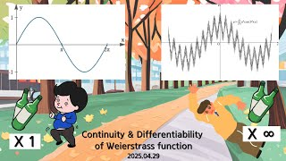

# 바이어슈트라스 함수의 연속성과 미분가능성 (Continuity & Differentiability of Weierstrass function)

**Speaker:** Yeon-woo Jeong (Sungkyunkwan University)  
   
## 
 Keyword 

바이어슈트라스 함수

미분가능성

바이어슈트라스 M 판정법

   
## 
 Abstract 

### 주제를 선택한 이유
고등학생 때 미적분학을 공부하면서 함수에 대한 이해력을 높여갔을 때 위 함수를 처음으로 접하였습니다. 직관에 반하는 함수를 처음 접하고 굉장히 큰 흥미를 느꼈지만, 완벽히 이해하진 못 하였습니다. 아마 저를 비롯한 대부분의 1~2학년들도 저랑 비슷할 것입니다.
그러므로 본 주제는 생소한 병리적 함수를 알아가며 중간으로 지친 1~2학년들에게 수학적 즐거움을 일깨워줄 수 있는 매력적인 주제여서 선택하였습니다.

### 이 세미나의 목표
기본적인 해석학 도구들을 이용하여 바이어슈트라스 함수의 미분가능성을 증명하고, 이를 통하여 다른 학부생들이 함수에 관한 폭을 넓히며 지적 유희를 느끼셨으면 합니다. 

### 어떤 점이 재밌나요?
엄밀한 증명을 통해 함수를 무한히 더했어도 연속성 및 미분 가능성을 논할 수 있다는 특이한 점, 그런 과정에서 알고 생각할 것이 늘어나 지적 유희를 즐길 수 있다는 점입니다.

### 이외에 하고 싶은 말
친구한테 잘난 척을 해보고 싶으신 분들, 특이한 함수를 접해보고 싶은 분들, 이제 막 중간고사가 끝난 1~2학년 분들, 최대한 쉽게 준비했으니 모두 많은 관심 부탁드립니다!

## Video Link

