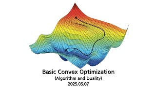

# Basic Convex Optimization (Algorithm and Duality)

**Speaker:** Kyungman Kim (Sungkyunkwan University)  
   
## 
 Keyword 

Convex Optimization

First-Order Method

Lagrangian Duality

   
## 
 Abstract 

### 주제를 선택한 이유
Convex Optimization 문제는 전자공학, 머신러닝은 물론, 경제학 등 다양한 분야에서 널리 활용됩니다. 더욱이, 많은 경우 일반적인 최적화 문제는 Convex Optimization 문제와 완벽하게 동치입니다. 따라서 Convexity와 Convex Optimization에 대한 이해는 최적화 이론의 출발점입니다.

### 이 세미나의 목표
이번 세미나의 전체적인 목표는 Convex Optimization의 기초 개념을 소개하는 것입니다. 주요 내용으로는 First-Order Method에 대한 초보적인 개요와 간략하게 Lagrangian Duality 이론을 다룰 예정입니다. 특히, 제약조건이 없는 경우에 잘 작동하는 Gradient Descent, Stochastic Gradient Descent, Proximal Point Method의 수렴성(convergence)을 살펴보고, 마지막으로 Dual Problem에 대해서도 간략히 소개하겠습니다.

### 어떤 점이 재밌나요?
Gradient Descent라는 용어는 아마 한 번쯤은 들어보셨을 것입니다. 이 알고리즘이 잘 작동할 것 같다는 느낌은 직관적으로 들지만, 실제로 그 수렴성을 증명하는 것은 다른 차원의 문제입니다. 이번 세미나에서는 그 막연한 직관을 넘어, 알고리즘이 어떻게 수렴하는지를 수학적으로 구체화하면서 그 과정의 즐거움을 함께 나눠보고자 합니다.

### 이외에 하고 싶은 말
사전지식(선형대수학, 해석학)을 거론하기는 했으나 그리 어려운 내용이 아니니, 편히 들으러 오시면 될 듯합니다.

## Video Link

