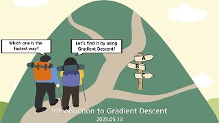

# Introduction to Gradient Descent

**Speaker:** Hojoon Lee (Sungkyunkwan University)  
   
## 
 주요어 

Loss(손실)

Gradient(기울기)

Back Propagation(역전파)

   
## 
 초록 

&emsp;다양한 분야에서 AI모델을 통해 작업을 수행하는 요즘, 인공지능이 어떻게 학습하는지 궁금한 사람들이 많을 것이라고 생각합니다. AI를 공부하기 위해서는 머신러닝, 특히 인공신경망을 사용하는 딥러닝에 대한 이해가 필요합니다. Gradient Descent(경사 하강법)은 인공신경망을 학습시킬 때 가중치를 업데이트하는 가장 기본적인 최적화 기법으로, 이 기법을 활용하여 인공지능이 어떤 방식으로 학습하는지 알려드리고 싶어 이 주제를 선택하게 되었습니다. 
&emsp;이번 세미나에서는 가중치에 대한 개념부터 시작하여 데이터를 입력했을 때 컴퓨터가 어떤 과정과 계산을 통해 학습하는지, 학습 과정에서 Gradient Descent의 역할은 무엇인지 알아보고자 합니다. 이때, 기울기를 구하는 효율적인 방법인 Error Backward Propagation(오차역전파법)도 소개할 예정입니다. 
&emsp;"AI, 딥러닝이 다 수학이더라" 라는 말을 한 번씩은 들어봤을 겁니다. 이번 세미나를 통해 왜 저런 말이 나왔을까에 대한 궁금증도 해결하고, 수학이 다른 학문에서 어떻게 활용되는지 알아볼 수 있다는 점도 흥미로울 것입니다. 또한, Python으로 작성되어있는 단순한 신경망을 보여드림으로써 컴퓨터가 손글씨를 어떻게 구별할 수 있을까에 대한 의문도 해결할 수 있을 것입니다. 
&emsp;이 세미나는 기초적인 머신러닝에 대해 다룹니다. 관심 있으신 분들의 많은 참석 바랍니다. 계산과 설명 위주의 세미나입니다. 어려운 이론도 없어서 편하게 들으시면 될 것 같습니다. 

## Video Link

