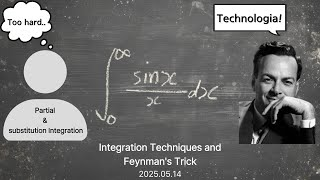

# Integration Techniques and Feynman's Trick

**Speaker:** Do-hyeon Park (Sungkyunkwan University)  
   
## 
 주요어 

적분

라이프니츠 적분 규칙

파인만 트릭

   
## 
 초록 

&emsp;대학교 수준 이상의 적분을 공부하다보면 고등학교의 치환적분과 부분적분만으로는 한계가 있음을 느낄 수 있습니다. 복소해석이나 푸리에 해석과 같은 심화 과정 없이 파인만의 트릭으로 고등학교 미적분 또는 대학교 미적분학 수준으로만 복잡하게 생긴 함수를 적분할 수 있다는 것이 매우 매력적이라고 생각하여 이 주제를 선택했습니다. 
&emsp;이번 세미나를 통해 부정적분 공식, 치환적분과 부분적분의 한계를 알려드리고, 라이프니츠 적분 규칙과 파인만의 트릭을 소개하고 싶습니다. 그리고 파인만의 트릭을 통해 적분 계산을 하는 새로운 시각을 알려주고, 이를 통해서 난해하게 생긴 함수도 적분 계산할 수 있음을 보여드리고 싶습니다. 
&emsp;파인만의 트릭을 이용하여 정말 난해하게 생긴 적분을 풀어나갈 때와 라이프니츠의 적분 규칙을 이용하여 쉬운 적분도 새로운 시각으로 풀어나갈 때 여러분이 재미를 느낄 수 있을거라고 생각합니다. 
&emsp;편히 들으러 오면 되겠습니다. 

## Video Link

