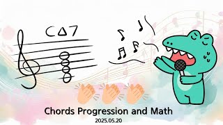

# Chords Progression and Math

**Speaker:** Ki-hyuk Kwon (Sungkyunkwan University)  
   
## 
 주요어 

경우의 수

순정률

협음과 불협화음

   
## 
 초록 

&emsp;저는 음악이 재밌습니다. 그건 여러분도 마찬가지일 거고요. 이 음악이란게 알면 알수록 재밌고 본질이 수학이라고 느낍니다. 저는 음악을 소울있게 느끼진 못합니다. 하지만 이론적으로나마 접근한다면, 그 과정을 보여줄 수 있다면, 제가 음악을 재밌어하는 이유를 공유할 수 있을 것 같습니다. 
&emsp;이번 세미나에서는 장조와 단조를 비율 관계를 통해 구분할 것입니다. 장조와 단조로 구성된 코드가 만들어지는 규칙들을 토대로 어떤 코드 진행들이 나올 수 있고, 실제로 가능한 조합들을 알아볼 것입니다. 최종적으로 어떤 히트곡들이 어떤 조합에 포함되는지를 바라보고자 합니다.  
&emsp;대중음악이 모두 같을 수는 없습니다. 같다면 표절이니까요. 그렇다고 모두 다르기만 한 건 아닙니다. 서로 다른 음악이 같을 수 있는 요소 중 하나가 바로 코드 진행입니다. 코드 진행을 직접 눈으로 보고 귀로 들어보실 수 있도록 세미나를 준비했기 때문에 세미나가 여러분께 재미있게 다가오리라 생각합니다.  
&emsp;수학보다 음악 시간이 될 것 같습니다. 즐기러 와주시면 감사하겠습니다.  

## Video Link

