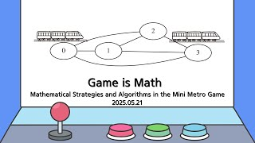

# Game is Math
(Mathematical Strategies and Algorithms in the Mini Metro Game)

**Speaker:** Jae-ung Lee (Sungkyunkwan University)  
   
## 
 Keyword 

게임

알고리즘

수학적 모델링

   
## 
 Abstract 

### 주제를 선택한 이유
저는 평소에 추상 전략 게임을 즐겨합니다. 그러던 중 지하철 운영 게임인 Mini Metro라는 게임을 해보며, 높은 점수를 얻기 위해 저만의 전략을 짜고 분석하는 과정을 수학적으로 접근해보면 어떨까하는 생각이 들었습니다. 그렇게 게임 데이터를 토대로 직접 공식을 세워보거나 1학년 때 배운 이산수학의 내용을 접목해보는 등 직접적으로 모델링을 해보았고, 실제로 더 좋은 결과가 나오게 되었습니다. 이처럼 게임 속이나 일상에서 일어나는 현상을 수학적으로 모델링하는 것에 대한 즐거움을 나눠보고자 이 주제를 선택하게 되었습니다.

### 이 세미나의 목표
먼저 Mini Metro라는 게임에 대해 간단히 소개해드리고, 직접 플레이하는 화면도 보여드릴 예정입니다. 다음으로 제 전략을 다른 비교군과 대조하며 어떠한 점에서 좋은지 설명드리겠습니다. 그 후에 특별 조건이 붙은 경우를 가정하여 전략을 일반화할 것입니다. 가능하다면 직접 플레이해보면서 본인만의 알고리즘을 생각해볼 수 있는 시간을 가질 계획입니다.

### 어떤 점이 재밌나요?
어떤 게임이든 직접 플레이를 하다보면 직관적인 전략이 보이기 마련입니다. 하지만 실제로 게임을 해보면 그 전략이 효율적이지 않은 경우가 종종 생깁니다. 그런 괴리감을 세미나를 통해 적나라하게 체험해볼 수 있다는 점이 꽤나 흥미로울 예정입니다. 또한 직관적 전략에서 나아가 수학적으로 계산했을 때 게임을 훨씬 효율적으로 운영할 수 있다는 점에서, 수학적 모델링의 정교함을 느낄 수 있다는 것도 재밌습니다.

### 이외에 하고 싶은 말
게임하러 온다고 생각하고 편하게 와주시면 좋겠습니다.

## Video Link

