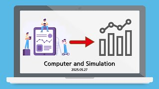

# Computer and Simulation

**Speaker:** Ji-un Ha (Sungkyunkwan University)  
   
## 
 주요어 

통계적 추정

효율성

Big-O

   
## 
 초록 

&emsp;시뮬레이션은 현실 세계의 현상을 가상 세계에 구축하여 여러 번 돌림으로써, 제한적인 정보만으로 현실의 현상을 설명하는 것을 목적으로 합니다. 간단한 예시로, 보통 시험 점수나 과제 점수를 확인하면, 본인 점수, 중앙값(평균), 최대 점수, 최소 점수 등의 정보가 주어지지만, 등수를 예상할 수 있는 분산에 대한 정보는 없는 경우가 많습니다. 그렇기에 이러한 상황에서 분산과 같은 정보를 어떻게 추정할 수 있을지, 이를 추정하는 시뮬레이션은 어떻게 구성할 수 있는지 소개해보고 싶어 이 주제를 선택하게 되었습니다. 더 나아가 단순히 이론적으로만 접근하는 것이 아닌, 컴퓨터를 통해 효율적으로 정보를 구하는 방법 또한 소개해보고자 합니다. 
&emsp;DS 과목을 통해 코딩을 경험한 사람은 많은 반면, 작성한 코드의 효율성을 평가하는 방법에 대해서는 잘 모르는 경우가 많습니다. 이에 이번 세미나에서는 프로그램의 효율성에 대한 기본적인 개념을 설명하고 예시를 통해 이해하는 과정을 거칠 예정입니다. 또한, 전체 집단의 정보를 가진 상태에서 표본을 추출하여 추정하는 방법인 Monte Carlo Method와 전체 집단의 정보가 없는 상태에서 추정하는 방법인 Bootstrap Method를 예시를 통해 소개할 예정입니다. 
&emsp;시뮬레이션은 우리가 일상생활 속에서 수없이 마주하는 간단한 상황들에 대해서도 적용할 수 있어 활용이 용이합니다. 특히 전체 집단에 대한 정보가 없거나 제한적인 상황에서도, 주어진 표본을 바탕으로 분산 등 새로운 정보를 추정할 수 있다는 점이 흥미롭습니다. 또한, 실제 상황이 아님에도, 시뮬레이션을 통해 추정한 정보가 높은 신뢰도를 갖는다는 점 또한 꽤나 흥미로울 예정입니다. 
&emsp;통계, 코딩이라는 어려운 용어가 등장했다고 도망가지 않으셨으면 좋겠습니다. 최대한 쉽게 설명할 수 있도록 준비했습니다. 앞으로 학점 추정에 있어 유용하게 활용되기를 바랍니다. 

## Video Link

