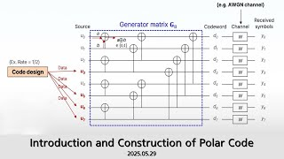

# Introduction and Construction of Polar Code

**Speaker:** Hyungju Lee (Sungkyunkwan University)  
   
## 
 주요어 

Polar Code

Reinforcement Learning

Genetic Algorithm

Beta-Expansion

   
## 
 초록 

&emsp;요즘 거의 모든 사람이 5G환경을 사용하고 있습니다. 이런 환경에선 통신하는 과정 중 필연적으로 발생하는 오류를 잡는 것이 중요합니다. 저는 이러한 문제를 해결하는 방식으로 채택된 polar code가 무엇인지와 어떻게 작동하는지를 알려드리고자 합니다. 또한 요즘 시대에 강화학습은 정말 여러 분야에 쓰이는데 그 중에 하나인 SARSA방식을 구체적인 예시로 보여드리고 싶어 이 세미나를 준비했습니다. 
&emsp;우선 polar code에 대해 설명하고 polar code에서 중요한 frozen bit와 information bit를 잡는 방법을 강화학습, 머신러닝으로 보여주는게 목표입니다. 또한, 중간중간에 세미나 주제에서 확장한 내용을 추가적으로 소개할 생각입니다. 
&emsp;사진을 보내거나 전화 같은 통신을 하면 의도치 않게 노이즈가 생기는데, 현재 우리는 어떤 방식으로 이 문제를 해결하는가에 대해 구체적으로 알 수 있다는 점이 이 세미나의 재미있는 점이라고 생각합니다. 
&emsp;신호 오류 처리라는 비교적 낯선 내용이기도 하고, 양이 많아 이해하기 힘들 수도 있지만, 쉽게 설명드릴 예정이니 많은 관심 부탁드립니다! 

## Video Link

