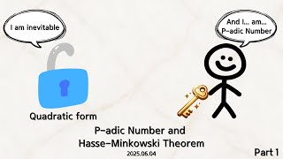
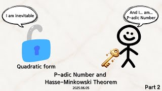

# P-adic Number and Hasse-Minkowski Theorem

**Speaker:** Donghyeon Seo (Sungkyunkwan University)  
   
## 
 주요어 

P-adic Number

RHasse-Minkowski Theorem

Quadratic Form

   
## 
 초록 

&emsp;우리는 어릴 때부터 다항방정식을 풀어왔습니다. 다항방정식을 풀다보면, 그 방정식이 유리수 근을 가지는지 궁금할 때가 종종 있습니다. 하지만 다항방정식이 유리수 근을 가지는지 판별하는 것은 쉽지 않은 문제입니다. 이러한 문제들을 공략하기 위해 새로운 수 체계인 p-adic number를 소개하고, 특정 다항식에 대해서 위의 문제에 대한 동치 조건을 제시해주는 Hasse-Minkowski Theorem에 대해 소개하고자 주제를 선택하게 되었습니다. 
&emsp;첫날에는 왜 우리가 방정식의 근의 존재성을 판별하고자 새로운 수 체계를 도입하려 하는지를 소개하려고 합니다. (Z[x]에서 해를 찾을 때, 두가지 자연스러운 질문이 떠오릅니다.) 그러면서 Q[x]의 해를 구하는 방향으로 p-adic number를 소개하고 그 구조를 알아볼 예정입니다. 
&emsp;둘째날엔 전날 배운 p-adic number에 이어서 Hilbert symbol등을 이용해 quadratic form에 대한 local global principle인 Hasse-Minkowski theorem을 소개하고 예시들을 알아볼 예정입니다. 
&emsp;실수가 아닌 수 체계에서도 해석학과 대수학을 할 수 있다는 점과, 특정 문제를 다른 체계로 변환시켰을 때 간단한 문제로 변환될 수 있다는 점이 흥미롭습니다. 또한 특정 이차 유리계수 방정식에 우리가 어떤 시도를 할 수 있는지 알 수 있습니다. 
&emsp;이번 세미나의 내용은 추후에 local field나 class field theroy와 같은 깊은 과목을 공부할 때 기본적인 예시가 됩니다.
또한, 밑의 렉쳐노트에서 보라색 형광펜으로 색칠한 부분에 관해 생각하고 오시면, 세미나를 이해하는 데에 도움이 됩니다. 

## Video Link

## Presentation Material
<a target='_blank' href='download/P-adicNumberandH-MTheorem.pdf'>Lecture Note: P-adic Number and Hasse-Minkowski Theorem </a>