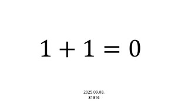

# 1+1=0

**Speaker:** Ye-sung Kook (Sungkyunkwan University)  
   
## 
 초록 

우리는 어릴 때부터 1+1=2라고 배워왔고, 이는 변하지 않는 절대적 진리라고 생각해왔습니다. 그러나 잘 생각해보면, 우리는 ‘덧셈’이라는 연산을 그동안 많이 봐왔을 뿐이지, 정의한 적이 없다는 사실을 아실 수 있습니다.  
그렇기에, 이번 세미나에선 덧셈을 정의하고, 그 정의 하에 여러가지 상황을 상상할 수 있다는 것을 알려드리고자 합니다. 이로써 결론적으로 수학이라는 학문이 엄밀성에만 치우쳐져있는 학문이 아닌, 상상의 자유로움을 느낄 수 있는 학문이라는 것을 알려드리고자 합니다. 
 

**사전지식:** 없음 

## Video Link

