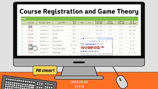

# Course Registration and Game Theory

**Speaker:** Seongeun Wang (Sungkyunkwan University)  
   
## 
 초록 

**
”왜 당신의 수강신청은 늘 실패하는가? — 게임이론으로 털어보는 불공정한 진실“
**
&emsp;우리는 매 학기, '수강신청'이라는 경쟁에 참여합니다. '선착순'이라는 공정해 보이는 규칙 아래, 모두가 동등한 기회를 가진다고 믿었죠. 하지만 과연 그럴까요? 이러한 수강신청 방식은 정말 공정한가요? 
&emsp;이번 세미나에서는 이 질문에 대한 답을 함께 찾아갑니다. 성균관대 '수강신청' 시스템을 응용수학의 한 분야인 '게임이론'으로 분석하고, 이 시스템의 공정하지 않은 방식을 분석할 것입니다. 궁극적으로, 다양한 게임이론을 바탕으로, 현재 수강신청 시스템의 불완전함을 폭로하고, 모두에게 진정으로 공정한 기회를 제공하는 새로운 매커니즘 디자인을 제시하고자 합니다. 

**사전지식:** 없음 

## Video Link

